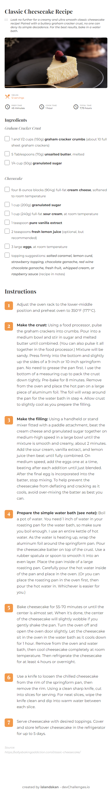
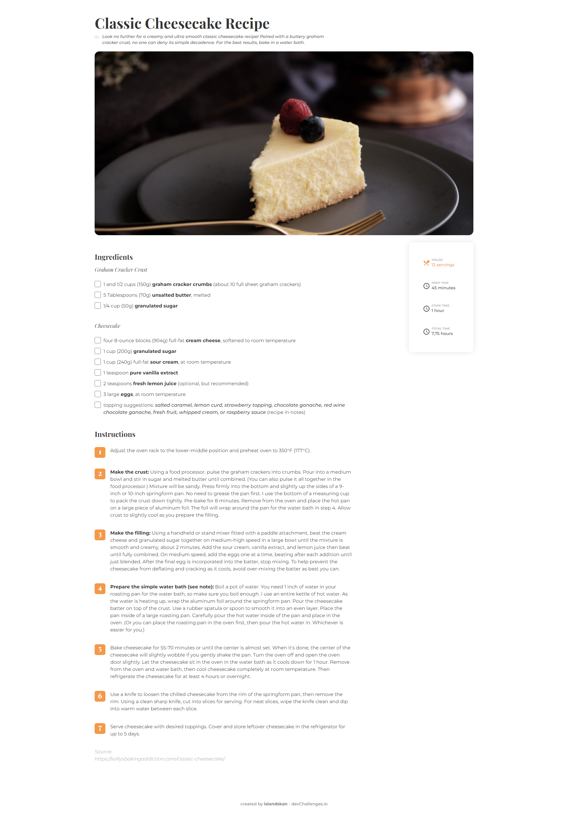

<!-- Please update value in the {}  -->

<h1 align="center">Recipe Blog</h1>

<div align="center">
   Solution for a challenge from  <a href="http://devchallenges.io" target="_blank">Devchallenges.io</a>.
</div>

<div align="center">
  <h3>
    <!-- <a href="https://{your-demo-link.your-domain}">
      Demo
    </a> -->
    <span> | </span>
    <a href="https://github.com/islandskan/devchallenges-responsive-recipe-blog">
      Solution
    </a>
    <span> | </span>
    <a href="https://devchallenges.io/challenges/OEKdUZ6xs0h99C38XVht">
      Challenge
    </a>
  </h3>
</div>

<!-- TABLE OF CONTENTS -->

## Table of Contents

-   [Overview](#overview)
    -   [Built With](#built-with)
-   [Features](#features)
-   [How to use](#how-to-use)
-   [Contact](#contact)
-   [Acknowledgements](#acknowledgements)

<!-- OVERVIEW -->

## Overview




-   I decided to learn and try TailwindCSS for the first time.
-   I learned how to use Tailwind, as well as how to install and run Tailwind through the CLI.
-   I liked working with Tailwind much more than I first expected! I have previously only worked with CSS libraries such as Bootstrap, Material-UI, and Semantic-UI. And unfortunately I don't enjoy working with component-based libraries, since I prefer seeing what properties are being used and being able to customize themes and configurations.
-   Because of this, I liked how Tailwind worked and I'm definately going to use it in the future.
-   Next up; I'm going to learn how to implement more advanced states, pseudo-elements, and interactivities.

### Built With

<!-- This section should list any major frameworks that you built your project using. Here are a few examples.-->

-   [Tailwind](https://tailwindcss.com/)
-   [Material Design icons](https://developers.google.com/fonts/docs/material_icons)

## Features

<!-- List the features of your application or follow the template. Don't share the figma file here :) -->

This application/site was created as a submission to a [DevChallenges](https://devchallenges.io/challenges) challenge. The [challenge](https://devchallenges.io/challenges/TtUjDt19eIHxNQ4n5jps) was to build an application to complete the following user stories:

-   [x] User story: I can see a recipe with ingredients and instructions.
-   [x] User story: I can select a checkbox if I have the ingredients
-   [x] User story: I can see the number of servings and baking times.
-   [x] Extras: When ingredient is checked, the text also gets checked off(line-through the text)

## How To Use

To clone and run this application, you'll need [Git](https://git-scm.com) and [Node.js](https://nodejs.org/en/download/) (which comes with [npm](http://npmjs.com)) installed on your computer. From your command line:

```bash
# Clone this repository
$ git clone https://github.com/your-user-name/your-project-name

# Install dependencies
$ npm install

# Run the app
$ npm start
```

## Acknowledgements

<!-- This section should list any articles or add-ons/plugins that helps you to complete the project. This is optional but it will help you in the future. For exmpale -->

-   [Tailwindcss Documentation](https://tailwindcss.com/docs/installation)
-   [TailwindCSS Tutorial playlist - The Net Ninja](https://www.youtube.com/playlist?list=PL4cUxeGkcC9gpXORlEHjc5bgnIi5HEGhw)
-   [TailwindCSS Just In Time Tutorial playlist - The Net Ninja](https://www.youtube.com/playlist?list=PL4cUxeGkcC9ht1OMQPhBVKAb2dVLhg-MJ)

## Contact

-   GitHub [@islandskan](https://github.com/islandskan)
-   LinkedIn [Sigridur Eggertsdottir](https://www.linkedin.com/in/sigridureggertsdottir/)
